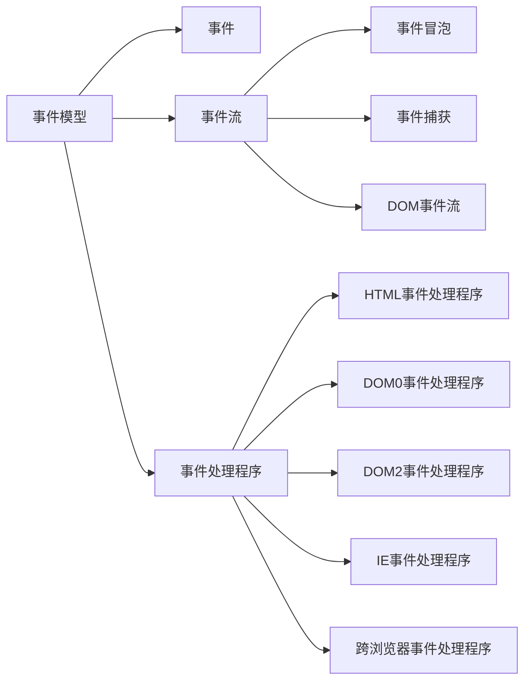

<!--
 * @Date: 2021-09-26 19:43:37
 * @LastEditors: chuhongguang
-->


### 事件
`JavaScript` 与 `HTML` 的交互是通过事件实现的，**`事件代表文档或浏览器窗口中某个有意义的时刻`**。

在事件发生时执行的监听器订阅事件，能够做到页面行为（在JavaScript中定义）与页面展示（在HTML和CSS中定义）的分离。

🎈补充历史：
> 事件最早是在IE3和Netscape Navigator2中出现的，当时的用意是把某些表单处理工作从服务器转移到浏览器上来。
到了IE4和Netscape Navigator 3发布的时候，这两家浏览器都提供了类似但又不同的API，而且持续了好几代。
DOM2 开始尝试以符合逻辑的方式来 标准化DOM事件API 。目前所有现代浏览器都实现了DOM2 Events的核心部分。
---

### 事件流


`IE` 和 `Netscape` 的开发团队，在开发第四代Web浏览器的时候对浏览器事件的理解上出现了分歧。

*页面哪个部分拥有特定的事件呢？*

当你点击一个按钮的时候，实际上不光点了这个按钮，还点击了它的容器以及整个页面。

**`事件流就是描述页面接受事件的顺序。`**

🎈补充历史：
> IE和Netscape开发团队提出了几乎完全相反的事件流方案。
IE将支持事件冒泡流，而Netscape将支持事件捕获流。

---


####  事件冒泡
`IE` 事件流被称为事件冒泡。

**`事件被定义为从最具体的元素（文档树中最深的节点）开始触发，然后向上传播至没有那么具体的元素（文档）。`**

> IE5.5及早起版本会跳过html元素（从body直接到document）。现代浏览器中的事件会一直冒泡到window对象。

####  事件捕获
`Netscape` 团队提出了另一种名为事件捕获的事件流。

事件捕获的意思是 **`最不具体的节点应该最先收到事件，而最具体的节点应该最后收到事件`**。事件捕获实际上是为了在 **`事件到达最终目标前拦截事件`** 。

> 当今浏览器都是从window对象开始捕获事件，而DOM2 Events规范规定的是从 document 开始。

####  DOM事件流


`DOM2 Events` 规范规定 **`事件流`** 分为 **`3个阶段`** ：事件捕获、到达目标和事件冒泡。

事件捕获最先发生，为提前拦截事件提供了可能。
然后，实际的目标元素接收到事件。
最后一个阶段是冒泡，最迟要在这个阶段响应事件。

> 在DOM事件流中，实际的目标（div 元素）在捕获阶段不会接收到事件。这是因为捕获阶段从 **`document -> html -> body`** 就结束了。
---

### 事件模型（事件处理程序）
事件意味着用户或浏览器执行的某种动作。
**`为响应事件而调用的函数`** 被称为 **`事件处理程序`** （或 **`事件模型`**、**`事件监听器`**）。

#### HTML事件处理程序
特定元素支持的每个事件都可以使用事件处理程序的名字以`HTML属性`的形式来指定。
此时属性的值必须是能够执行的`JavaScript代码`。

```html
  <!-- 指定 javaScript代码值 -->
  <input type="button" value="on click" onclick="console.log('click me')">
```
点击按钮之后，控制台会输出一段信息。
这种交互能力是 通过 `onclick` 属性指定 `javaScript代码值` 来实现的。

```html
  <!-- 调用在页面其他地方定义的脚本 -->
  <input type="button" value="on click" onclick="showInfo()">
  function showInfo() {
    console.log('click me')
  }
```
在HTML中定义的事件处理程序也可以 **`调用在页面其他地方定义的脚本`** 。

以这种方式指定的事件处理程序有一些 **`特殊的地方`** 。
1. 会创建一个函数来封装属性的值。这个函数有一个 `特殊的局部变量event` ，其中保存的就是 `event对象` 。
```html
  <input type="button" value="on click" onclick="console.log(event.type)">
  <!-- 打印结果：click -->
```
2. `在这个函数中，this值` 相当于 `事件的目标元素` 。
```html
  <input type="button" value="on click" onclick="console.log(this.value)">
  <!-- 打印结果：on click -->
```
3. 这个动态创建的包装函数，其 `作用域链被扩展` 了。
```html
  <form method="post">
    <input type="text" name="username" value="">
    <input type="button" value="on click value" onclick="console.log(username.value)">
  </form>
```
点击按钮之后，会打印当前输入的 input中的值。
元素是一个表单输入框，则作用域链中还会包含表单元素, 可以直接访问同一表单中的其他成员。


> 事件处理程序对应的函数相当于右边的方式

**`问题：`**
1. `时机问题`
有可能HTML元素已经在页面上了，用户都与其进行交互了，但是 事件处理程序的代码还没加载进来
2. 对事件处理程序`作用域链的扩展`在不同浏览器可能导致不同的结果
不同的javaScript引擎中标识符解析的规则存在差异，因此访问无限定的对象成员可能导致错误。
3. `HTML` 与 `JavaScript` 强耦合
如果需要修改事件处理程序，则必须在两个地方（HTML、JS）中修改代码
---
#### DOM0事件处理程序
我们经常使用的 `element.onclick = function(){}`，这种方式的事件处理程序就是`DOM0事件处理程序`。

DOM0事件处理程序有两种绑定事件的方式，分别是 `内联模型` 和 `脚本模型`。

##### 内联模式
内联模型又称为“行内绑定”，其绑定事件的方式是直接将函数名作为HTML标签某个事件的属性值。
```html
<button onclick="func（）">按钮</button>
```
**`缺点：`**
违反W3C关于HTML与JavaScript分离的基本原则。

##### 脚本模式
脚本模型又称为“动态绑定”，其绑定的方式是通过在JavaScript中选中一个节点，并给节点的onlick事件添加监听函数。

例如：
```html
<body>
  <div id="myBtn">点我啊</div>
</body>
```
```js
<script>
let btn = document.getElementById('myBtn');
btn.onclick = function () {
  console.log('on cliclk');
  // 事件处理程序会在元素的作用域中运行，即this等于元素
  console.log(this.id); // myBtn
}
</script>
```
像这样使用DOM0方式为事件处理程序赋值时，所赋函数被视为元素的方法。
因此，事件处理程序会在元素的作用域中运行，即**`this等于元素`**。

#####  优缺点
`优点：`
实现了HTML与JavaScript分离，符合W3C的基本原则。

`缺点：`
1. 同一节点只能绑定一个同类型事件，如果绑定多次，则只有最后一次生效。
2. 只有绑定事件，没有取消事件。
```
btn.onclick = null // 移除事件处理程序
```
> 但是，可以通过将事件处理程序属性的值设置为null，移除通过DOM0方式添加的事件处理程序。
---
####  DOM2事件处理程序
DOM0绑定事件的两种方式都有其局限性。
为了解决DOM0事件处理程序所存在的局限性，DOM2事件处理程序应运而生。
##### 添加事件绑定
使用 `addEventListener（）`进行事件绑定。

```js
let btn = document.getElementById('btn')

btn.addEventListener('click', funcyion() {
	// click 触发时执行的回调函数
}, true/false)
```

`addEventListener`接收3个参数:
① 第一个参数是触发的事件类型，主要事件名称不需要用“on”开头。
② 第二个参数是触发事件时执行的回调函数。
③ 第三个参数是模型参数，表示事件冒泡或事件捕获，false（默认）表示事件冒泡，true表示事件捕获。

> 大多数情况下，事件处理程序会被添加到事件流的冒泡阶段，主要原因是跨浏览器兼容性好。把事件处理程序注册到捕获阶段通常用于在事件到达其指定目标之前拦截事件。如果不需要拦截，则不要使用事件捕获。

#####  取消事件绑定
DOM2和DOM0相比有一个非常重要的区别，就是使用 **`DOM2绑定的事件可以取消事件绑定`**。
如果要 **`取消事件绑定`**，那么在绑定事件时，**`回调函数必须使用有名函数`**，而不能使用匿名函数。

使用 `removeEventListener（）`取消事件绑定。
```
btn.removeEventListener("click"，函数名)
```
#####  优点
相比于DOM0事件处理程序:
1）实现了HTML与JavaScript的分离，符合W3C关于内容与行为分离的要求。
2）使用DOM2绑定的事件，可以取消事件绑定。
3）使用DOM2可以为同一节点添加多个同类型事件，多个事件可以同时生效，而不会被覆盖掉。

DOM2可以为同一节点添加多个同类型事件
```html
<body>
  <div id="myBtn">点我啊</div>
</body>
```
```js
<script>
let btn = document.getElementById('myBtn');
btn.addEventListener('click', btnEvent1)
btn.addEventListener('click', btnEvent2)

function btnEvent1() {
  console.log('btnEvent1');
}
function btnEvent2() {
  console.log('btnEvent2');
}
</script>
```
---
#### IE事件处理程序
**`IE实现了与DOM2类似的方法`**，即 `attachEvent()` 和 `detachEvent()`。

#####  添加事件绑定
使用 `attachEvent（）`进行事件绑定。
```js
let btn = document.getElementById('btn')

btn.attachEvent('onclick', funcyion() {
	// onclick 触发时执行的回调函数
})
```
attachEvent接收两个参数：
① 第一个参数是触发的事件类型，主要事件名称需要用 on 开头。
② 第二个参数是触发事件时执行的回调函数。
> 因为IE8及更早版本只支持事件冒泡，所以使用attachEvent()添加的事件处理程序会添加到冒泡阶段。

为同一节点添加多个同类型事件
```html
<body>
  <div id="myBtn">点我啊</div>
</body>
```
```js
<script>
var btn = document.getElementById('myBtn');
btn.attachEvent('onclick', btnEvent1);
btn.attachEvent('onclick', btnEvent2);

function btnEvent1() {
  console.log('btnEvent1');
}
function btnEvent2() {
  console.log('btnEvent2');
}
</script>
```
版本问题：


> 低版本IE支持该方法，IE 11不支持了，edge 也不支持了，现在主流浏览器都支持 DOM2事件处理程序的 addEventListener 和 removeEventListener。

#####  取消事件绑定
如果要 **`取消事件绑定`**，那么在绑定事件时，**`回调函数必须使用有名函数`**，而不能使用匿名函数。

使用 `detachEvent（）`取消事件绑定。
```
btn.detachEvent("onclick"，函数名)
```

#####  和DOM处理程序不同点
1）IE事件处理程序会以添加它们的顺序反向触发。


2）事件处理程序的作用域不同。

使用`DOM0`、`DOM2`方式时，事件处理程序中的 **`this值等于目标元素`**。
而使用attachEvent()时，事件处理程序是在全局作用域中运行的，因此 **`this等于window`**。
```html
<body>
  <div id="myBtn">点我啊</div>
</body>
```
```js
<script>
var btn = document.getElementById('myBtn');
// btn.addEventListener('click', btnEvent1)
// btn.addEventListener('click', btnEvent2)
btn.attachEvent('onclick', btnEvent1);
btn.attachEvent('onclick', btnEvent2);
function btnEvent1() {
  console.log(this === window, this.id);
  console.log('btnEvent1');
}
function btnEvent2() {
  console.log('btnEvent2');
}
</script>
```


#### 跨浏览器事件处理程序
为了以跨浏览器兼容的方式处理事件，很多开发者会选择使用一个JavaScript库，其中抽象了不同浏览器的差异。
自己`编写跨浏览器事件处理代码也很简单`，主要依赖能力检测。要确保`事件处理代码具有最大兼容性`，只需要`让代码在冒泡阶段`运行即可。
```js
  var EventUtil = {
    addHandler: function (element, type, handler) {
      if (element.addEventListener) {
        element.addEventListener(type, handler, false);
      } else if (element.attachEvent) {
        element.attachEvent("on" + type, handler);
      } else {
        element["on" + type] = handler;
      }
    },
    removeHandler: function (element, type, handler) {
      if (element.removeEventListener) {
        element.removeEventListener(type, handler, false);
      } else if (element.detachEvent) {
        element.detachEvent("on" + type, handler);
      } else {
        element["on" + type] = null;
      }
    }
  };
```

两个方法都是首先检测传入元素上是否存在DOM2方式。

如果有DOM2方式，就使用该方式，传入事件类型和事件处理函数，以及表示冒泡阶段的第三个参数false。

否则，如果存在IE方式，则使用该方式。
注意这时候必须在事件类型前加上"on"，才能保证在IE8及更早版本中有效。

最后是使用DOM0方式（在现代浏览器中不会到这一步）。
注意使用取消事件的时候，DOM0方式时使用了中括号计算属性名，并将事件处理程序或null赋给了这个属性。

`使用：`
```js
  var btn = document.getElementById("myBtn")
  var handler = function () {
    console.log("Clicked");
  };
  EventUtil.addHandler(btn, "click", handler);
  // 移除
  // EventUtil.removeHandler(btn, "click", handler);
```

### 附录
- [JavaScript高级程序设计（第4版）-马特·弗里斯比](https://weread.qq.com/web/reader/751326d0720befab7514782kc81322c012c81e728d9d180)
- [Web前端学习笔记：HTML5+CSS3+JavaScript - 王涛 杨延成 姜浩](https://weread.qq.com/web/reader/a9a3225071ddaaada9a7954kc81322c012c81e728d9d180)