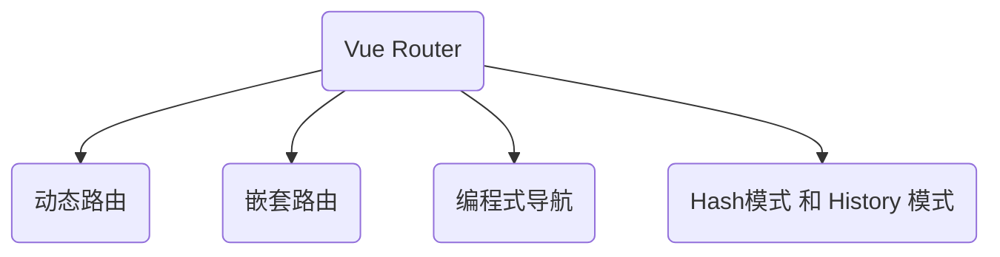

<!--
 * @Date: 2021-10-03 10:34:23
 * @LastEditors: chuhongguang
-->

### 前言
> 本次主要整理一些自己看来掌握不太好的地方，欢迎讨论哦~

```mermaid
	graph
    A(Vue Router) --> B(动态路由)
    A(Vue Router) --> C(嵌套路由)
    A(Vue Router) --> D(编程式导航)
    A(Vue Router) --> E(Hash模式 和 History 模式)
```

### 动态路由
### 嵌套路由
### 编程式导航
### Hash模式 和 History 模式