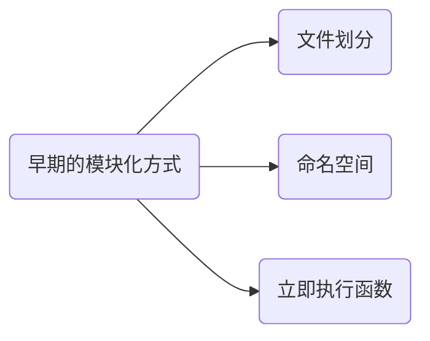

<!--
 * @Date: 2021-10-03 09:08:05
 * @LastEditors: chuhongguang
-->
### 模块化概念
>  随着业务的复杂，开发中的代码到了需要管理的程度。
- **模块化** 是一种主流的代码组成方式，将业务代码按照模块划分成不同的文件，从而提高开发效率，降低维护成本。
- **模块化** 是一种思想、理论，并不包含具体的实现。
---
### 早期的模块化方式

#### 1. 文件划分的方式
将每个功能和数据存储在不同的文件之中，约定每一个文件就是一个独立的模块。
在需要使用的地方引入`js`，一个`script`标签就是一个模块，在引用的地方，调取全局的方法即可使用。

🎈例子:

会暴露出如下缺点：
  - 污染全局作用域
  - 命名冲突问题
  - 无法管理模块依赖关系

#### 2. 命名空间方式
在 以文件划分的方式 的基础之上，将模块包裹成全局对象的方式实现。

🎈例子:

优缺点:
- 减少命名冲突的可能，但是没有私有空间，模块内的成员外部依然可以访问和修改。
- 模块之间的依赖关系，依然没有解决。
#### 3. IIFE（立即执行函数）
每一个模块都放到函数私有作用域当中，对于需要暴露的成员，可以通过挂载到全局对象的方式去实现。

🎈例子:

优缺点:
- 实现了私有空间：引入模块后，自由成员只能在模块内部通过闭包的方式去访问，外部无法使用。
- 使用自执行函数的参数来当做依赖声明来使用 ，使模块之间的依赖关系变得更加明显。

### 模块化规范的出现
- 为了统一不同的开发者和不同的项目之间的差异，需要一个标准来规范模块化实现的方式。
- 针对模块化加载的问题，之前都是通过 `script` 标签引入的方式加载模块，这会导致模块不受代码的控制，时间久了，维护麻烦。

**所以**, 需要一些基础的公共代码，自动的帮加载模块。
`模块化标准 + 模块加载器（模块的基础库）`
于是，就出现了模块化规范

### 近年来常见的几种模块化规范
#### CommonJS规范
#### AMD(Asynchronous Module Definition)
#### Sea.js + CMD
#### ES Modules
##### 介绍 ES Modules
##### Babel兼容方案
---
### 参考
- [模块化开发与规范化标准(模块化开发)](https://blog.csdn.net/weixin_41962912/article/details/111173186)